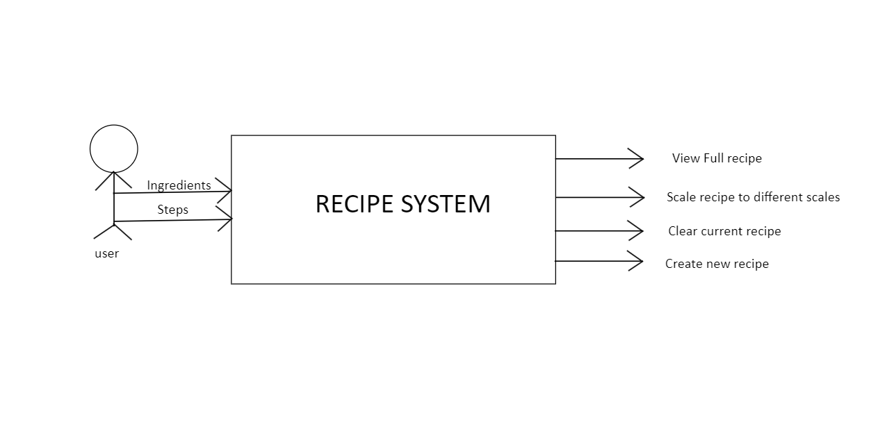

# Recipe_System_Part1
## This repository contains a console application written in C# that captures the details of a recipe (Ingredient details and steps) and desplays them with some extrea fuctionalities)
This application is built for chefs, people in the calinary field and everyday food lovers that would like to record and store their favorite recipes in a computer program. The program will not only take on the recipe but it will also provide the following fucntionalities to manipulate the details of the recipe: 

*Create a new recipe
*Enter new recipe ingrediant and steps
*Scale recipe by a factor of 1 or 2 or 3 or 0.5.
*Scace the recipe back to normal values.
*Clear a recipe and enter a new recipe.

The part about scaling basically allows the user to half, double or triple the original measurements of the recipe ingrediants. This is done incase a user would like to icrease the amount of output product that a recipe produces at original scale.
## Basic system diagram image

## User instructions
1. Clone project from git hub.
2. If you cannot clone project just download project as a file.zip and extract file contents once the are extracted.
3. Open Microsoft Visual studio or your IDE of choice that can run a C# console application that does of .NET VERSION 8 long-term support. (It is advisable to open project using Microsoft visual studio with .NET Version 8 to avoid running into any incompatibility issues that may arise.).
4. Once project is open view the solution on IDE and run solution.
5. Application will first ask for how many ingredients are required and how may steps the recipe must have.
6. The application will now prompt you to enter the following details about each ingredient:
    - The name of ingrediant
    - Quantity (double variable)
    - Unit of measure of quantity
7. After all ingrediant details have been entered the user will be asked to enter each step of the recipe according to the number of steps that the user indicated at the beggining of the sytem run.
8. The system will then desplay the following menu for the user to choose from:
    1. Display at original Scale
    2. Display at double Scale
    3. Display at triple Scale
    4. Display at half Scale
    5. Exit/ Enter another Recipe
9. The system will allow the user to enter different options until they decide that they are done withe the recipe and want to exit the system or choose enter another recipe.

## If you want to make changes to project
This is an open project and therefore any one is free to download and rename the file and make any kind of changes that they desire. Users can change the project to suit their own needs and even make vital improvements to the project that can help the project to fuction better than it does now.

## If you find a bug
In case that you find a but please put in a a file detailing the bug and a probable solutin when you submit a pull request.

## Looking to the future
For part two of this project there will be the following funtions:
1. User will be able to add the food group of an ingredient.
2. User will also be able to add the number of calories for each ingredient.
3. The system will be able to record and store the details of multiple recipes at once.
4. The user will be able to choose froma a list of recipes that they have entered into the system and view their details.
5. The system will be able to alert the user of a HIGH CALORIES warning if the ingredients of a particular recipe exceed a maximum calory count of 300 calories.

## Thank you for reading
I hope you enjoy using this project, Thank you.
## Github Repository Link
<a href="https://github.com/ST10375898/Recipe_System_Part1">Repository Link</a>
## Screeshot of Repository Commit

